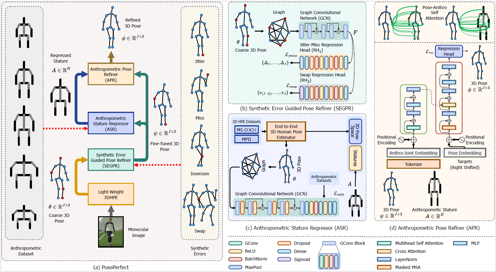
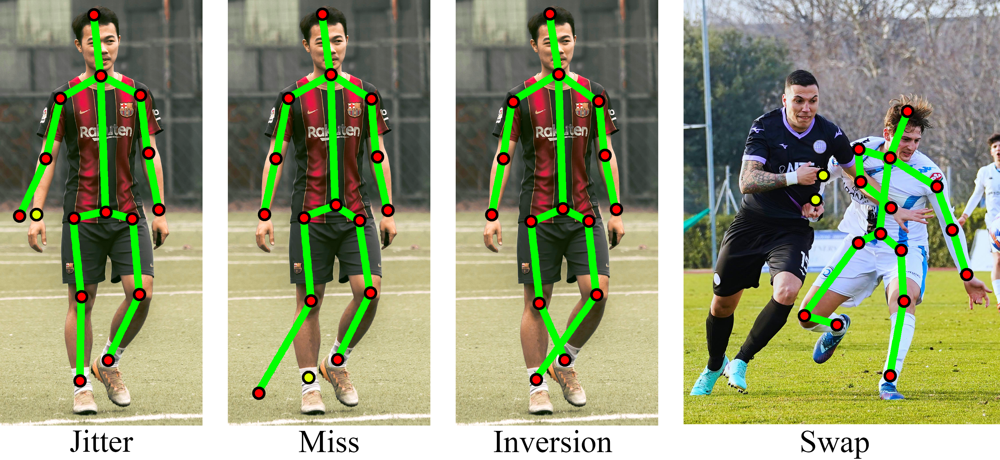
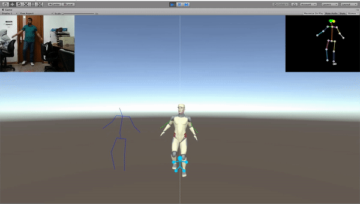
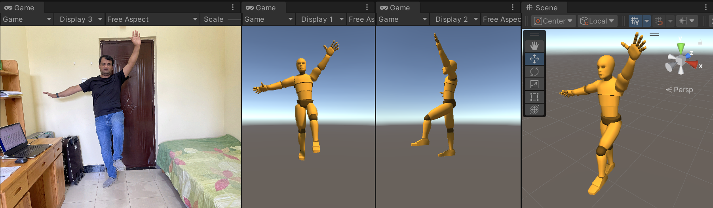
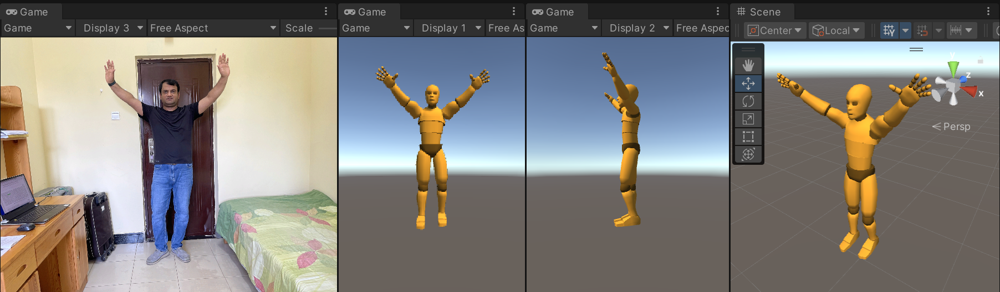
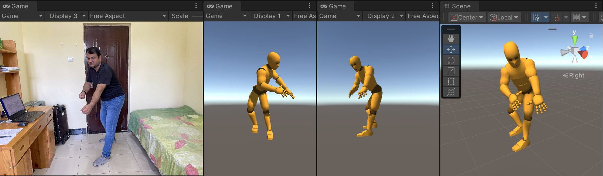
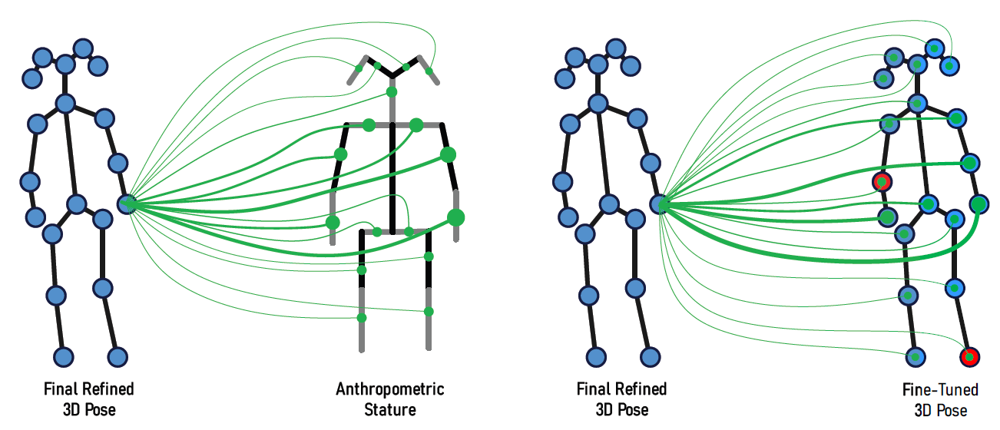
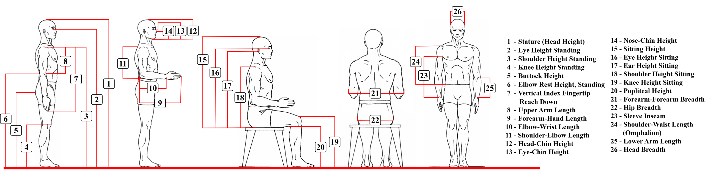

# PosePerfect: Refining 3D Human Pose Estimation using Anthropometric Constraints and Synthetic Localization Errors
PosePerfect is a novel framework designed for improving the accuracy of 3D human pose estimation from monocular images. Despite advancements in deep learning techniques, existing methods for 3D pose estimation often suffer from significant localization errors, largely due to depth ambiguities and occlusions. PosePerfect tackles these challenges by incorporating anthropometric constraints to model bone-length dependencies and introduces synthetic localization errors for joint refinement.

Anthropometric Constraints: Leverages accurate human body segment data to enhance pose prediction.
Synthetic Localization Error Module: Reduces errors such as jitter, inversion, and missed joints.
Extensive Evaluations: Outperforms state-of-the-art methods on benchmark datasets (Human3.6M and MPI-INF-3DHP), achieving significant improvements in pose accuracy.

Synthetic Error Guided Pose Refiner (SEGPR): Fine-tunes 3D pose estimates by learning from synthetic localization errors.
Anthropometric Stature Regressor (ASR): Predicts the closest matching anthropometric stature for improved joint accuracy.
Anthropometric Pose Refiner (APR): Uses anthropometric bone-length data to further refine and correct 3D pose estimations.

## Our model

## Localization errors

## Demo 1: Controlling fullbody digital avatar in Unity3D

## Demo 2: Controlling fullbody digital avatar in Unity3D

## Demo 3: Controlling head pose for a digital avatar in Unity3D

## Demo 4: Controlling head pose for a digital avatar in Unity3D

## Driving avatar for qualitative evaluation

## Pose-Anthro self attention

## Anthropometric measures

## Authors
Anam Memon,
Qasim Arain,
Ali Asghar Manjotho,
Meshari Huwaytim Alanazi,
Mueen Uddin,
Mohammad Shorofuzzaman
